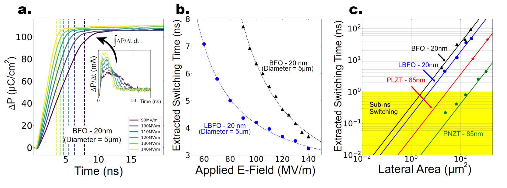
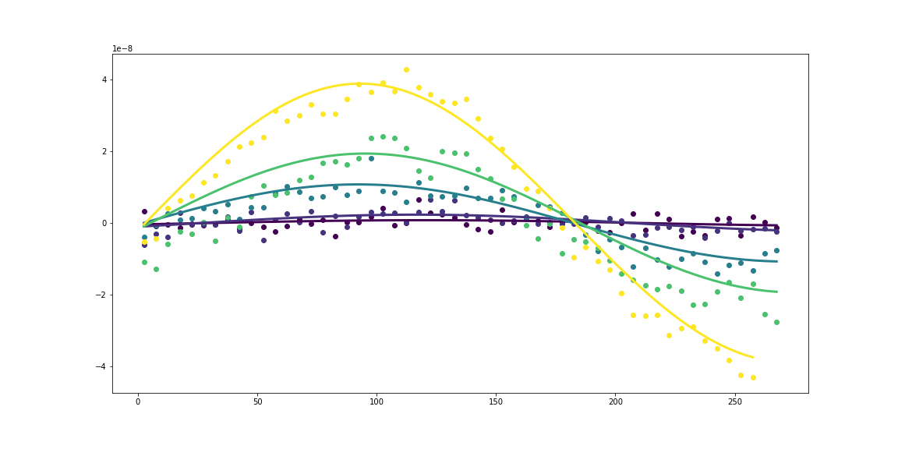

# Welcome to ekpmeasure 


[](http://ekpmeasure.readthedocs.io/?badge=latest)
[](https://pypi.org/project/ekpmeasure/)
[](https://pypi.org/project/ekpmeasure/)
[](http://pepy.tech/project/ekpmeasure)

[](https://journals.aps.org/prl/abstract/10.1103/PhysRevLett.125.067601)

A repository of analysis and computer control code for various experiments. Image above is an example of data **collected** and **analyzed** using this package.

- [User Guide](#user-guide)
- [Installation](#installation)


# Overview

ekpmeasure is a set of control and analysis code designed to help streamline experiments. The basic idea is that in experimental work we often take data from many different sources, store it in different places, have varying degrees meta data associated with the data (even for a single type of data) and somehow(!) we are supposed to make sense of it all. We like to compare across trials, days, experimental conditions, etc. and it is very difficult to keep track of what data is where, and quickly access it when we need it. Often I find that folks end up copying and pasting raw data between excel spreadsheets and if you're not careful you will quickly lose track of which data came from where. This package's goal is to make this all easier. 

You may not find the experimental control code as helpful as it is relatively specific to my research in condensed matter physics (though electrical engineers or similar may find it very useful) but the analysis code is for everyone. 

At the heart of the analysis is the [Dataset](https://ekpmeasure.readthedocs.io/en/latest/ekpmeasure.analysis.html#ekpmeasure.analysis.core.Dataset) class which is a means of manipulating *meta data alone* in order to locate which actual data you want to analyze. [Datasets](https://ekpmeasure.readthedocs.io/en/latest/ekpmeasure.analysis.html#ekpmeasure.analysis.core.Dataset) don't care about what the real data looks like, and they keep track of where different data is stored so it is easy to select which data you want to look at - only then do you retrieve the data. The real data is returned in a [Data](https://ekpmeasure.readthedocs.io/en/latest/ekpmeasure.analysis.html#ekpmeasure.analysis.core.Data) class which allows you to group by parameters, perform calculations and much more.  

I am always improving this repository and if you have suggestions, I appreciate any feedback and or issues (<https://github.com/eparsonnet93/ekpmeasure/issues>)

## User Guide

Here, we will walk through a brief example of how the analysis power of `ekpmeasure`. Scientists often have large amounts of data, stored in different locations and with varying degrees of available meta data. ekpmeasure makes it easier to access all of this data. Once created, you can easily load a [Dataset](https://ekpmeasure.readthedocs.io/en/latest/ekpmeasure.analysis.html#ekpmeasure.analysis.core.Dataset)

``` python
path = './path/to/data/'
dset = analysis.load_Dataset(path)
dset.readfileby = lambda x: pd.read_csv(x, skiprows=12, delimiter = '\t') # Specify how to read the real data

# query meta data subject to some set of conditions:
tmpdset = dset.query('`Samplename` == "hr358_D1" and Field == 5')

# return the real data
data = tmpdset.get_data()

# center the real data
centered_data = data.apply(center_yaxis, key = 'Y2')

# average the data over a specific window (here the data is a function of angle, and we average over a window of 5 degrees)
windowed_data = centered_data.apply(window, window_size = 5, key = 'Y2')

### plot the data colored by a meta data parameter (in this case `Amplitude (mA)`) ###

# establishing normalization for a colormap
amps = np.array(sorted(data.summary['Amplitude (mA)']))
max_amp = max(amps)
min_amp = min(amps)

# setup a figure and colormap
fig, ax = plt.subplots(figsize = (16,8))
cmap = cm.viridis

for i in windowed_data:
    tdata = windowed_data.iloc[i] # pick off a single trial
    amp = list(tdata[i]['definition']['Amplitude (mA)'])[0] # get the amplitude for that trial
    color = cmap((amp - min_amp)/(max_amp - min_amp)) # specify the color from the normalized colormap
    
    tdata.scatter(x = 'angle', y = 'Y2', alpha = 1, ax = ax, color = color) # scatter the data
    fit_data = tdata.apply(fit_sine, anglekey = 'angle', key = 'Y2') # apply a fitting function to the data
    fit_data.plot(x = 'fakex', y = 'simulated', ax = ax, color = color, linewidth = 3) # plot the fit
```



For more see [here.](https://ekpmeasure.readthedocs.io/en/latest/start.html)


---
# Installation:

Find the latest build [here](https://pypi.org/project/ekpmeasure/).

```bash
pip install ekpmeasure
```

For installation issues, please see [Issue Tracker](https://github.com/eparsonnet93/ekpmeasure/issues)

---
# Development

We welcome new contributors of all experience levels. The **Development Guide** has detailed information about
contributing code, documentation, tests, etc.

## Important Links

* Official source code repo: https://github.com/eparsonnet93/ekpmeasure
* Issue tracker: https://github.com/eparsonnet93/ekpmeasure/issues

## Source code

# Support 

Code related issues (e.g. bugs, feature requests) can be created in the
[issue tracker](https://github.com/eparsonnet93/ekpmeasure/issues)

Maintainer: Eric Parsonnet

# Citation 

Please cite this work as:

```shell
ekpmeasure
Eric Parsonnet, 2021
https://github.com/eparsonnet93/ekpmeasure
```