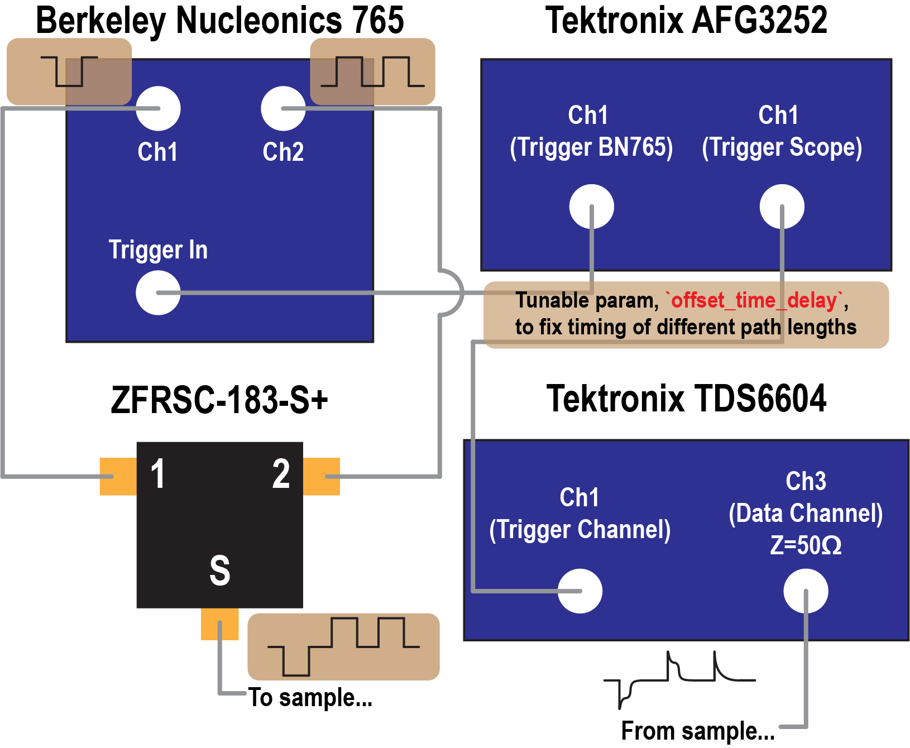

# Installation

1. Navigate to the directory where you wish install the experimental control notebook and run

```bash
python -m ekpmeasure.experiments.ferroelectric._fastPUND --name <notebook_name>
```

This will create a notebook with name `<notebook_name>` which can be used to run the fast PUND measurements.

# Measurement Schematic


[](#https://github.com/eparsonnet93/ekpmeasure/tree/main/src/ekpmeasure/experiments/ferroelectric/_fastPUND)


# List of Instruments Used:

1. [Berkeley Nucleonics Fast Rise Time Pulse Generator](#https://www.berkeleynucleonics.com/model-765-800-mhz-fast-rise-time-pulse-generator)
	- Used to apply the fast pulses to the ferroelectric. Channels 1 and 2 are set with opposite polarity and time-delayed relative to another. These signals are combined in the power combiner to create the pulse train for the sample.
2. [Tektronix TDS6604 Oscilloscope](#https://www.valuetronics.com/pub/media/vti/datasheets/Tektronix%20TDS6404,%20TDS6604.pdf)
	- Use to collect the data. Typically use Channel 1 as trigger channel (from AFG3252 Channel 2) and Channel 3 as data channel (from sample)
3. [Tektronix AFG3252 Pulse Generator](#https://download.tek.com/manual/071163106web_0.pdf)
	- Used to trigger the BN765 (Channel 1) and the scope (Channel 2). 
4. [ZFRSC-183-S+ Power Splitter/Combiner](#https://www.minicircuits.com/pdfs/ZFRSC-183-S+.pdf)
	- Combines positive and negative polarity pulses from BN765 to create pulse train. 